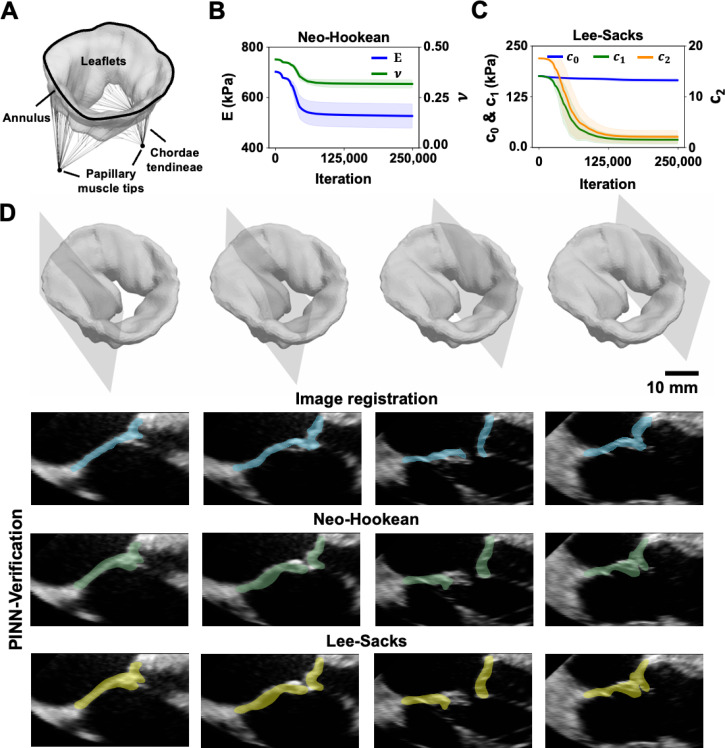
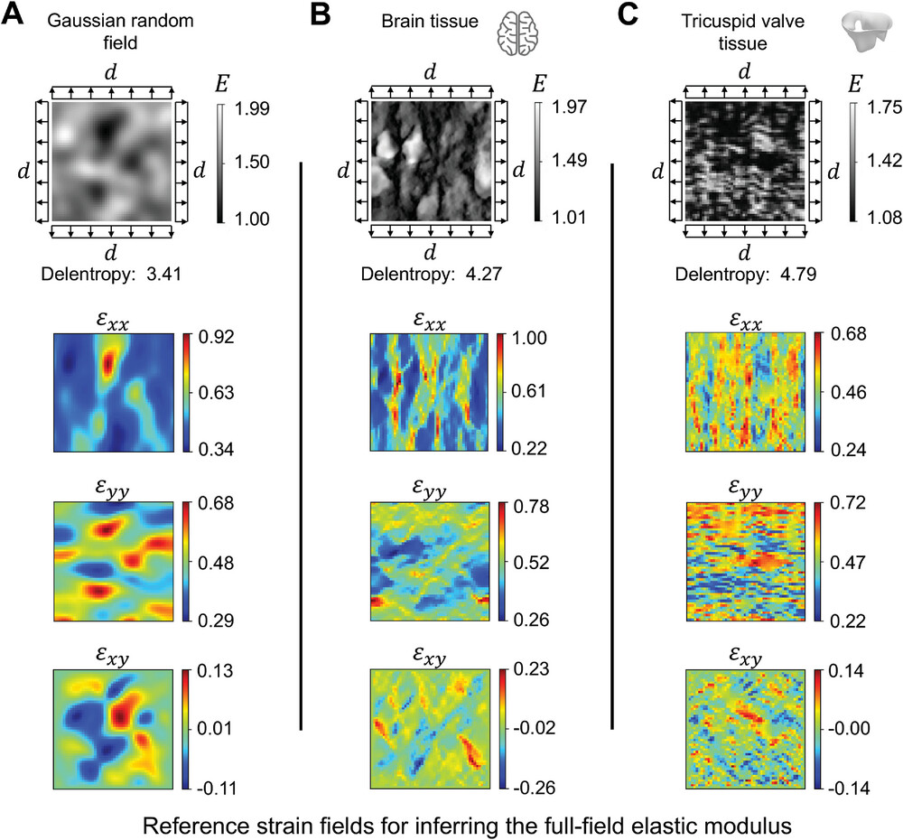
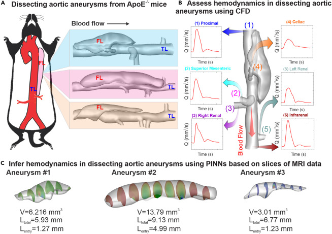
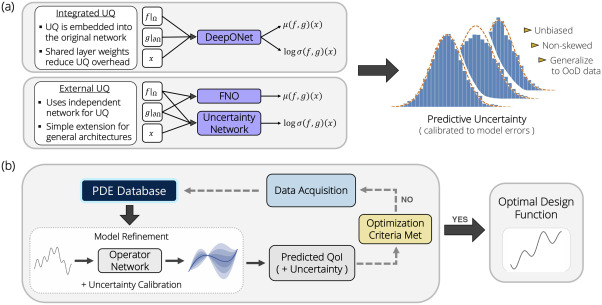
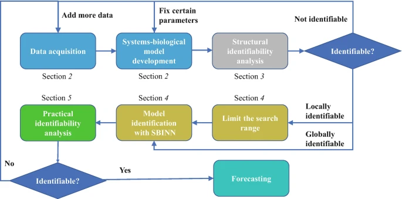

# Mitchell Daneker: ML for Scientific Computing, Simulation, & Biology

PhD candidate in Chemical & Biomolecular Engineering (University of Pennsylvania). I build **physics-informed** and **operator-learning** ML systems that interface with **real simulators** and **biological/biomedical data**. My work spans patient-specific valve mechanics to CFD radiation solvers to protein design and focuses on methods that are **deployable**, **data-efficient**, and **trustworthy**.

**mitchelldaneker@gmail.com**

---

## At a glance
- **Core specialties:** Physics-Informed Neural Networks (PINNs), Deep Operator Networks (DeepONet), inverse problems, PDE/ODE surrogate modeling, transfer learning, and uncertainty-aware workflows.
- **Domains:** Biomechanics & medical imaging, CFD & fire science, systems biology, protein engineering, and robotics.
- **Tooling:** PyTorch, NumPy/SciPy, JAX (light), ONNX, CUDA basics; C++ interop; OpenFOAM/FireFOAM integration; Python packaging; experiment tracking; GitHub Actions.
- **Outcomes:** 44× and up speedups for simulation pipelines, patient-specific material property estimation from noninvasive imaging, and robust inverse modeling frameworks with automatic validation and optimization.

> **Figures shown below are from published work only.** Unpublished project figures are intentionally omitted until cleared for sharing.

---

## Highlights

### 1) Patient‑specific valve tissue properties via PINNs - Acta Biomaterialia (2025)
**Paper:** A noninvasive method for determining elastic parameters of valve tissue using physics‑informed neural networks

Developed ADEPT to estimate patient‑specific tricuspid valve material properties directly from 3D TEE imaging to enable better surgical modeling.  

**Links:** [Paper](https://www.sciencedirect.com/science/article/pii/S1742706125003472?via%3Dihub) · [Code](https://github.com/lu-group/adept)

> Material parameter identification procedure. (A) Example cases considered in the current study were a 2D thick-walled cylinder subject to internal pressure (Example 1), a 2D thin circular plate subjected to transverse pressure (Example 2), a 3D truncated cone subject to external pressure (Example 3), and a 3D image-derived patient-specific regurgitant tricuspid valve model subject to transvalvular pressure (Example 4). (B) The PINN architecture contained a two-layer parallel network with two feedforward networks that independently predict displacements and stresses. The reference displacement data of the example cases were used to guide the minimization of data loss in PINN. In Examples 1 and 2, the analytical solutions of displacements were sought. Displacements in Example 3 were estimated through FEA, and those in Example 4 were approximated using deformable image registration illustrated in (C). The temporal component was included in the input data for the tricuspid valve example to support the calculation of the inertia term in the momentum governing equation.

---

### 2) Heterogeneous micromechanics in realistic tissues - Small Methods (2024)
**Paper:** Identifying Heterogeneous Micromechanical Properties of Biological Tissues via Physics‑Informed Neural Networks

Created a PINN method to determine material properties based on tissue experimentals.

**Links:** [Paper](https://onlinelibrary.wiley.com/doi/10.1002/smtd.202400620) · [Code](https://github.com/lu-group/pinn-heterogeneous-material)

> Heterogeneous material examples. The examples are presented in the undeformed configuration of unit square specimens. These examples represent the unknown elastic properties distribution of soft tissue that we seek to identify using PINNs. The structural complexity of the sample was quantified using Delentropy; higher values indicate greater complexity. A) The structural pattern is synthetically generated using a GRF. B) The representation of the brain tissue microstructure was adapted from Koos et al. C) The fibrous network of the tricuspid valve was adapted from Weinberg et al. Equibiaxial deformation of magnitude d was applied to the undeformed configuration using FEA to obtain the ground truth strain distribution. We prescribed 40% equibiaxial stretch to the specimen (i.e., 20% to each side of the boundary) and estimated the resulting Green-Lagrangian strain using FEniCS. The strain data were used as ground truth reference data to identify the “unknown” elastic moduli in PINNs inversely.

---

### 3) Tracking hemodynamics in evolving aortic dissection - **Nexus** (2024)
**Paper:** Transfer learning on PINNs for tracking hemodynamics in the evolving false lumen of dissected aorta  

Created a transfer‑learning strategy for PINN that cuts runtime across varying boundaries/resolutions while assimilating MRI data.

**Links:** [Paper](https://www.cell.com/nexus/fulltext/S2950-1601(24)00014-7) · [Code](https://github.com/lu-group/pinn-thrombus-mri)

  

> (A) Three realistic geometries of dissecting aortic aneurysms reconstructed from ApoE−/− mice are employed to examine the accuracy and efficiency of the proposed PINN model. (B) Assessment of hemodynamics in dissecting aortic aneurysms using a conventional CFD approach requires the knowledge of the flow BCs at all the inlets and outlets as well as the vessel boundaries for aneurysm, aorta, and its different branches. (C) Assessment of hemodynamics in dissecting aortic aneurysms using PINNs only needs partial information of the flow field provided by MRI or other modalities (i.e., the velocities on the slices highlighted in the figure).

---

### 4) Active operator learning with predictive UQ - **Journal of Computational Physics** (2026)
**Paper:** Active operator learning with predictive uncertainty quantification for partial differential equations  

Created and validated a general, scalable UQ method for operator networks with active learning and Bayesian optimization workflows.

**Links:** [Paper](https://www.sciencedirect.com/science/article/pii/S0021999126001415)

  

> (a) The uncertainty-equipped operator network architecture splits predictions into mean and variance estimates. Depending on the operator network used, the uncertainty predictions could be integrated into the network like for our DeepONet, or an external (secondary) network such as for FNO. Which framework is used will depend on network architecture, but generalizes to any operator network. We interpret network outputs as parameters for a predictive probability distribution, which are calibrated to the observed error distributions during training. (b) The uncertainty estimates provided by the operator networks are employed to help guide outer-loop data aquisition procedures in function spaces. The quantity of interest (QoI) and variance estimates are derived from the operator network predictions, and this information is used to guide data acquisition by balancing exploitation and exploration.

---

### 5) Systems‑Biology‑Informed Neural Networks (SBINN) - Methods in Molecular Biology (2023)
**Paper:** Systems Biology: Identifiability Analysis and Parameter Identification via Systems‑Biology‑Informed Neural Networks  

Developed a general framework that uses PINN‑style constraints for inverse problems and identifiability analysis in biological ODE models.

**Links:** [Paper](https://link.springer.com/protocol/10.1007/978-1-0716-3008-2_4) · [Code](https://github.com/lu-group/sbinn)

> Step 1: Data acquisition and systems-biological model development (Subheading 2). As the first step, we need to collect experimental data for the underlying system and develop ODEs to model the system dynamics. This is not the focus of this chapter, and we directly use the ultradian endocrine model for glucose-insulin interaction [2].

>Step 2: Structural identifiability analysis (Subheading 3). With a proposed model, we determine which parameters of the model are structurally identifiable. If the parameters are not structurally identifiable, Step 1 is revisited such as adding more data or fixing certain parameters. If the parameters are locally identifiable, we need to limit their search range.

>Step 3: Parameter estimation via systems-biology informed neural network (SBINN) (Subheading 4). We next use an SBINN to infer the unknown model parameters from the data.

>Step 4: Practical identifiability analysis (Subheading 5). With the inferred parameters, we check the quality of the estimates via practical identifiable analysis. If the parameters are practically identifiable, we can use the identified model for forecasting; otherwise, we need to revisit Step 1.

---

## Current projects
- **DeepONet integration in FireFOAM’s radiation solver**:: extended to 3D problems; achieved ~44× speedups for CFD inference and demonstrated real‑time deployment within an industrial solver.  
- **SBINN continuation:** pushing to large‑scale cell models and low‑data regimes; benchmarking against swarm optimization and differentiable physics approaches.
- **DeepONet surrogate models for spatiotemporal bio‑systems:** simplifying PDE systems to temporal‑only surrogates with downstream UQ hooks.
- **Genetically Encoded Voltage Indicators (GEVIs):** ML‑driven framework designed for experimentalists.

---

## Selected open‑source
- **SBINN:** https://github.com/lu-group/sbinn
- **PINN material identification (solid mechanics):** https://github.com/lu-group/pinn-material-identification
- **Transfer‑learning PINNs for aortic dissection (Nexus):** https://github.com/lu-group/pinn-thrombus-mri
- **Heterogeneous micromechanics (Small Methods):** https://github.com/lu-group/pinn-heterogeneous-material
- **ADEPT (valve mechanics):** https://github.com/lu-group/adept

---

## Publications (chronological)
1. Kristen M. Baker, Diana Lucas Baca, Shane Plunkett, **Mitchell E. Daneker**, and Mary P. Watson. Engaging Alkenes and Alkynes in Deaminative Alkyl–Alkyl and Alkyl–Vinyl Cross‑Couplings of Alkylpyridinium Salts. *Org. Lett.*, 2019. [Paper](https://pubs.acs.org/doi/abs/10.1021/acs.orglett.9b03899)
2. **Mitchell Daneker**, Zhen Zhang, George Em Karniadakis and Lu Lu. Systems Biology: Identifiability Analysis and Parameter Identification via SBINN. *Methods in Molecular Biology*, 2023. [Paper](https://link.springer.com/protocol/10.1007/978-1-0716-3008-2_4) · [Code](https://github.com/lu-group/sbinn)
3. Wensi Wu, **Mitchell Daneker**, Matthew A. Jolley, Kevin T. Turner, and Lu Lu. Effective Data Sampling Strategies and Boundary Condition Constraints of PINNs for Identifying Material Properties in Solid Mechanics. *Applied Mathematics and Mechanics*, 2023. [Paper](https://link.springer.com/article/10.1007/s10483-023-2995-8) · [Code](https://github.com/lu-group/pinn-material-identification)
4. Antonio Weiller Corrêa do Lago, Daniel Henrique Braz de Sousa, Pedro Henrique Domingues, **Mitchell Daneker**, and Lu Lu. Physics‑Informed and Black‑Box Identification of Robotic Actuator with a Flexible Joint. *IFAC‑PapersOnLine*, 2024. [Paper](https://www.sciencedirect.com/science/article/pii/S2405896324013181)
5. **Mitchell Daneker†**, Shengze Cai†, Ying Qian, Eric Myzelev, Arsh Kumbhat, He Li, and Lu Lu. Transfer learning on PINNs for tracking hemodynamics in the evolving false lumen of dissected aorta. *Nexus*, 2024. [Paper](https://www.cell.com/nexus/fulltext/S2950-1601(24)00014-7) · [Code](https://github.com/lu-group/pinn-thrombus-mri) · [**Cover Article**](https://www.cell.com/nexus/issue?pii=S2950-1601(24)X0003-0#)
6. Wensi Wu, **Mitchell Daneker**, Kevin T. Turner, Matthew A. Jolley, and Lu Lu. Identifying Heterogeneous Micromechanical Properties of Biological Tissues via PINNs. *Small Methods*, 2024. [Paper](https://onlinelibrary.wiley.com/doi/10.1002/smtd.202400620) · [Code](https://github.com/lu-group/pinn-heterogeneous-material)
7. Wensi Wu, **Mitchell Daneker**, Christian Herz, Hannah Dewey, Jeffrey A. Weiss, Alison M. Pouch, Lu Lu, and Matthew A. Jolley. noninvasive method for determining elastic parameters of valve tissue using PINNs. *Acta Biomaterialia*, 2025. [Paper](https://www.sciencedirect.com/science/article/pii/S1742706125003472?via%3Dihub) · [Code](https://github.com/lu-group/adept)
8. Nick Winovich†, **Mitchell Daneker†** , Lu Lu, and Guang Lin. Active operator learning with predictive uncertainty quantification for PDEs. *Journal of Computational Physics*, 2026. [Paper](https://www.sciencedirect.com/science/article/pii/S0021999126001415)
9.  Xiaoyi Lu, **Mitchell Daneker**, Lu Lu, and Yi Wang. Machine learning accelerated radiative transfer modeling in CFD fire simulations. *Fire Safety Journal*, 2026. [Paper](https://www.sciencedirect.com/science/article/pii/S0379711226001876)

† These authors contributed equally to this work.

---

### Notes for hiring managers / collaborators
- I’m especially interested in R&D roles that combine scientific ML with simulation (CFD/FEA) and applied AI for engineering. Remote or PA‑region preferred.
- Happy to discuss collaboration, consulting, or tech transfer of the frameworks above.

